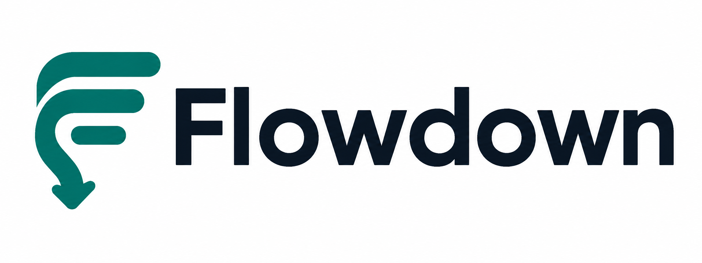

<p align="center">
  
</p>

[English](../README.md) | **简体中文**

**专为流式场景打造的响应式 Markdown 渲染库。**

从 AI 对话到实时预览，Flowdown 随内容到达持续渲染 Markdown，让不断增长的内容保持流畅，并让你自由控制渲染结果的外观与行为。

可以直接使用现有的 React 组件，也可以基于框架无关的核心构建自己的渲染器。

## 特点

- **高性能。** 复用未变化的内容块，减少新文本到达时的渲染开销。
- **纯响应式。** 文本、配置和插件都响应状态变化，渲染结果自动更新，无需手动刷新。
- **高度可定制。** 自定义样式，也可以用自己的组件渲染链接、代码块等元素。
- **插件化。** 通过可组合的插件扩展 Markdown 语法与渲染方式。
- **核心层框架无关。** [`@flowdown/core`](../packages/core/docs/README.zh-CN.md) 基于框架无关的 [`reactive`](../packages/reactive/docs/README.zh-CN.md) 包构建，可用于实现不同 UI 框架的渲染器。

## 快速上手：React

以下示例使用 `flowdown` 包提供的 React 组件。

### 安装

在已有的 React 项目中安装：

```sh
npm install flowdown
```

### 渲染 Markdown

```jsx
import { Flowdown } from "flowdown";

export default function App() {
  return <Flowdown text={"# Hello, Flowdown\n\nMarkdown that **keeps up**."} />;
}
```

### 流式渲染

将截至当前收到的完整 Markdown 文本传给 `text`，每收到一个新片段，就将它追加到应用状态中的文本末尾。Flowdown 会随文本增长自动更新，可以搭配你使用的任意流式 API。

```jsx
import { Flowdown } from "flowdown";

export function StreamingMessage({ text }) {
  return <Flowdown text={text} config={{ repair: true, repairEnding: true }} />;
}
```

## 参与贡献

欢迎报告问题、改进文档或提交 Pull Request。[报告问题](https://github.com/hexmora/flowdown/issues)时，请提供最小复现示例，以及触发问题的 Markdown 输入。

开发命令和 Pull Request 指南见 [CONTRIBUTING.md](../CONTRIBUTING.md)。

## 许可证

[MIT](../LICENSE)
